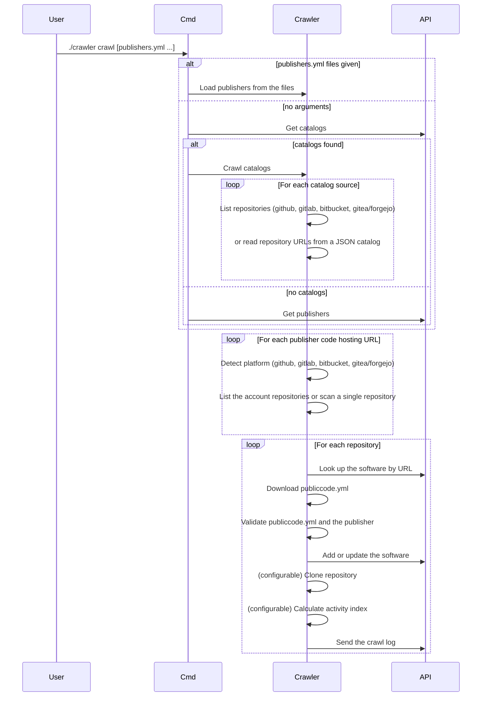

### Crawler flow

```mermaid
sequenceDiagram
    User->>Cmd: ./crawler crawl [publishers.yml ...]
    alt publishers.yml files given
        Cmd->>Crawler: Load publishers from the files
    else no arguments
        Cmd->>API: Get catalogs
        alt catalogs found
            Cmd->>Crawler: Crawl catalogs
            loop For each catalog source
                Crawler->>Crawler: List repositories (github, gitlab, bitbucket, gitea/forgejo)
                Crawler->>Crawler: or read repository URLs from a JSON catalog
            end
        else no catalogs
            Cmd->>API: Get publishers
        end
    end
    loop For each publisher code hosting URL
        Crawler->>Crawler: Detect platform (github, gitlab, bitbucket, gitea/forgejo)
        Crawler->>Crawler: List the account repositories or scan a single repository
    end
    loop For each repository
        Crawler->>API: Look up the software by URL
        Crawler->>Crawler: Download publiccode.yml
        Crawler->>Crawler: Validate publiccode.yml and the publisher
        Crawler->>API: Add or update the software
        Crawler->>Crawler: (configurable) Clone repository
        Crawler->>Crawler: (configurable) Calculate activity index
        Crawler->>API: Send the crawl log
    end
```
